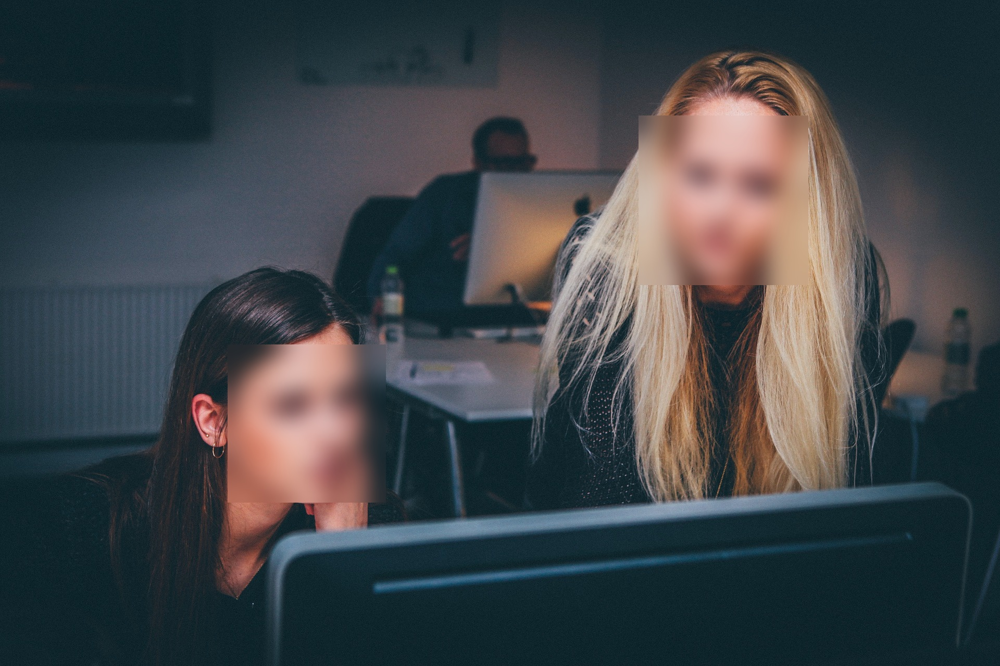

# AutoFaceBlur
Processes a video from a camera source or video file source, blurs a detected
object in the image using a trained Haar cascade classifier while tracking
that object to make sure all the frames are properly blurred. Made with real-time
processing in mind.

## Requirements
_Python 3_ with _NumPy_ and _OpenCV 3.1+_. 

## Running
```
usage: autofaceblur.py [-h] (-c CAMERA | -v VIDEO | -i IMAGE) [-o OUTPUT_FILE]
                       [-p] [--variable_fps] [--show_fps] [--save_fps]
                       cascade_source

Processes a video from a camera source or video file source, blurs a detected
object in the image using a trained Haar cascade classifier while tracking
that object to make sure all the frames are properly blurred. Note that if the
input is passed as a video or camera source the output will be a video, if it
is an image the output will be an image.

positional arguments:
  cascade_source        Path to the trained haar cascade classifier source
                        file.

optional arguments:
  -h, --help            show this help message and exit
  -c CAMERA, --camera CAMERA
                        Integer representing the camera souce index
  -v VIDEO, --video VIDEO
                        Path to the video file that will be processed.
  -i IMAGE, --image IMAGE
                        Path to the image file that will be processed.
  -o OUTPUT_FILE, --output_file OUTPUT_FILE
                        Path where the processed video or image file will be
                        stored.
  -p, --hide_processing
                        Shows a window while processing the video.
  --variable_fps        Takes into account the processing time of the frame to
                        track the object, only recommended for camera input.
  --show_fps            Shows fps in the a window while processing the video.
  --save_fps            Saves the video fps as it was captured to the video
                        output_file.

```

## Sample output



## References